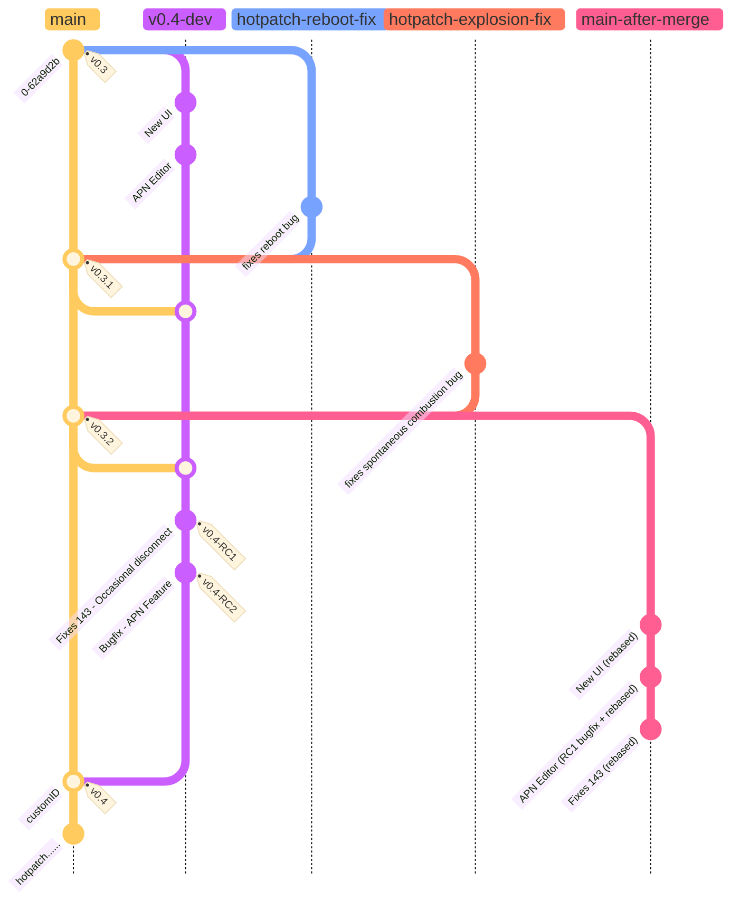

# Jangala's Git Versioning and Release Strategy

## Introduction

This document outlines our Git versioning and release strategy starting with Device Code but extending to all our work. This approach aims to ensure the possibility for rapid bugfixes, code stability and hygeine, and maintain a clean and informative project history. We try to explain each aspect of the strategy and provide a rationale for the decisions made.

## Overview

Since Mermaid can't show rebases yet, we shown in the main-after-merge the effects of doing interactive rebase, in which it will look as if v0.4 was branched straight after the last bugfix and also the bugfix for the APN editor (revealed by RC1) could be integrated into the main commit for that feature.

### 1. Stable Main Branch

**Decision:** Before reaching version 1.0, the `main` branch will always represent the latest stable release.

**Rationale:** By keeping the `main` branch stable, anyone cloning or forking the repository can rely on it as a working version of the code. This practice minimises confusion and ensures that contributors and users have access to a functional codebase.

### 2. Release Tags

**Decision:** Releases will be tagged with version numbers, starting with "0.3." All releases will be tagged commits on the `main` branch. All Release Candidates will be tagged on their respective point-release branches. Given that we'll rebase before merging with main, RC's will be lost from the main branch.

**Rationale:** Tagging releases with version numbers is a standard practice in software development. It allows users to easily identify and access specific releases for reference, deployment, or troubleshooting.

### 3. Development Branches

**Decision:** For each point release (e.g., 0.4, 0.5), a dedicated branch will be created for feature development and bug fixes.

**Rationale:** Creating separate branches for different point releases isolates development efforts. It ensures that work on new features and fixes does not interfere with the stability of the `main` branch or other ongoing development efforts.

### 4. Bugfix Branches

**Decision:** Bugfix branches will be created from the stable `main` branch (e.g., 0.3) for immediate fixes.

**Rationale:** In the event of critical bugs or issues that require immediate attention, creating bugfix branches from the stable `main` branch allows us to address these problems promptly while maintaining the stability of the current release.

### 5. Release Candidates

**Decision:** Release candidates for a full point release will be prepared and tested in the point release branch.

**Rationale:** Using the point release branch for release candidates allows us to thoroughly test and prepare for upcoming releases without disrupting ongoing development in other branches. It also helps ensure that the release is as stable as possible.

### 6. Interactive Rebase

**Decision:** Before merging a point release branch (e.g., 0.4) into the `main` branch, an interactive rebase will be performed to maintain a clean and linear project history.

**Rationale:** Interactive rebasing helps organise commits and create a clear, informative, and linear project history. This practice enhances code readability and traceability.

### 7. Commit Messages

**Decision:** Clear and informative commit messages will be used for all commits.

**Rationale:** Well-written commit messages provide context and clarity, making it easier for team members and contributors to understand the purpose and significance of each commit. This practice improves collaboration and code review.

### 8. Documentation

**Decision:** A document or README will be included in the repository to explain the versioning and release strategy.

**Rationale:** Providing documentation within the repository helps new contributors and team members understand our Git workflow and strategy. It serves as a reference point for best practices and ensures consistency in project management.

## Example: Managing "Devicecode"

To illustrate how this versioning and release strategy will be applied, let's consider how we would manage a project like "Devicecode":

1.  **Stable Main Branch:** The `main` branch of the "Devicecode" repository will always represent the latest stable release (e.g., 0.3).

2.  **Release Tags:** Releases of "Devicecode" will be tagged with version numbers (e.g., v0.3).

3.  **Development Branches:** For each new point release (e.g., 0.4), a dedicated branch (e.g., `v0.4-dev`) will be created for feature development and bug fixes.

4.  **Bugfix Branches:** In the event of critical bugs or issues in the stable release (e.g., 0.3), bugfix branches (e.g., `v0.3-bugfix`) will be created for immediate fixes.

5.  **Release Candidates:** Release candidates for version 0.4 will be prepared and tested in the `v0.4-dev` branch.

6.  **Interactive Rebase:** Before merging the `v0.4-dev` branch into `main`, an interactive rebase will be performed to maintain a clean project history.
